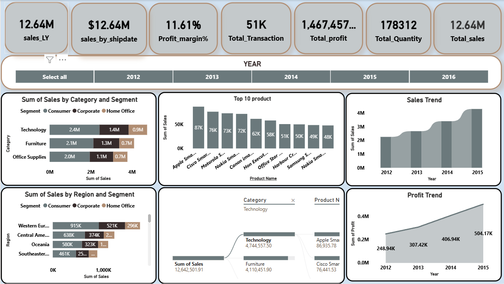
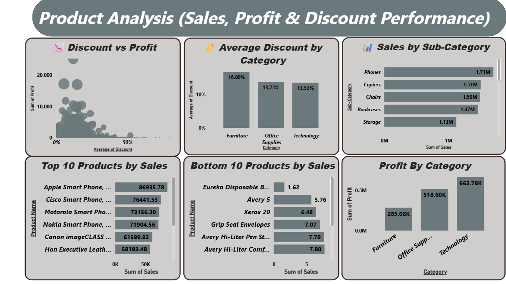
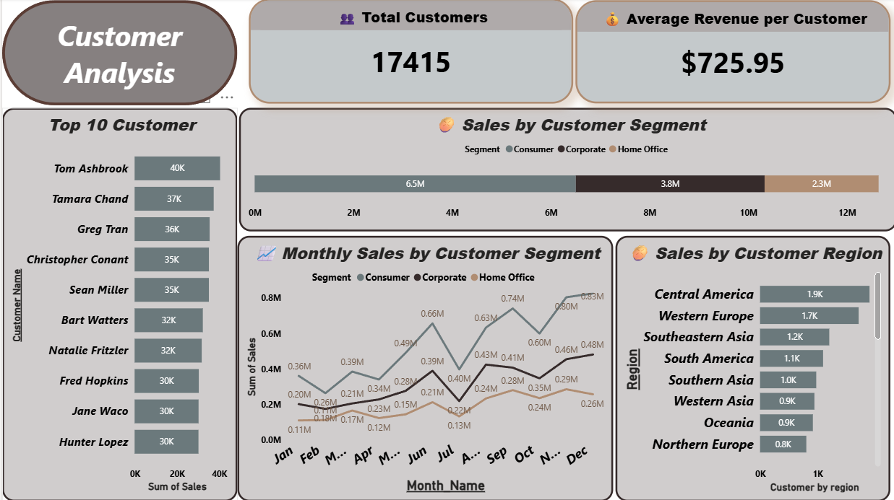

# 📊 Power BI Sales Dashboard

## 📌 Project Overview

This project is an interactive **Power BI Sales Dashboard** designed to analyze business performance and provide actionable insights. The dashboard enables users to monitor KPIs, evaluate sales trends, analyze customer behavior, and identify top-performing products.

---

## 🎯 Objectives

- Analyze overall sales performance
- Track business KPIs
- Identify top-selling products
- Understand customer behavior
- Support data-driven decision making

---

## 🛠 Tools Used

- Power BI
- Power Query
- DAX
- Microsoft Excel

---

# 📈 Dashboard Pages

## 📋 Executive Summary

The Executive Summary page provides a high-level overview of the business performance through key KPIs and interactive visualizations.

### Highlights
- 💰 Total Sales
- 💵 Total Profit
- 📦 Total Orders
- 👥 Total Customers
- 📈 Sales Trend
- 🌍 Regional Performance

---

## 📦 Product Analysis

This page focuses on product performance and profitability.

### Insights
- Top Selling Products
- Sales by Category
- Profit by Product
- Quantity Sold
- Product Performance Comparison

---

## 👥 Customer Analysis

This page analyzes customer behavior and purchasing patterns.

### Insights
- Top Customers
- Customer Segmentation
- Sales by Customer
- Customer Contribution
- Regional Customer Analysis

---

## 💡 Key Business Insights

- Identified the best-performing products and categories.
- Compared regional sales performance.
- Analyzed customer purchasing behavior.
- Monitored business KPIs to support strategic decisions.

---

## 📂 Repository Contents

- 🖼 Executive Summary.png
- 🖼 Product Analysis.png
- 🖼 Customer Analysis.png
- 📖 README.md

---

## 👤 Author

**Omar Khaled**

Aspiring Data Analyst

**Skills:** Excel | SQL | Python | Power BI | Data Visualization
